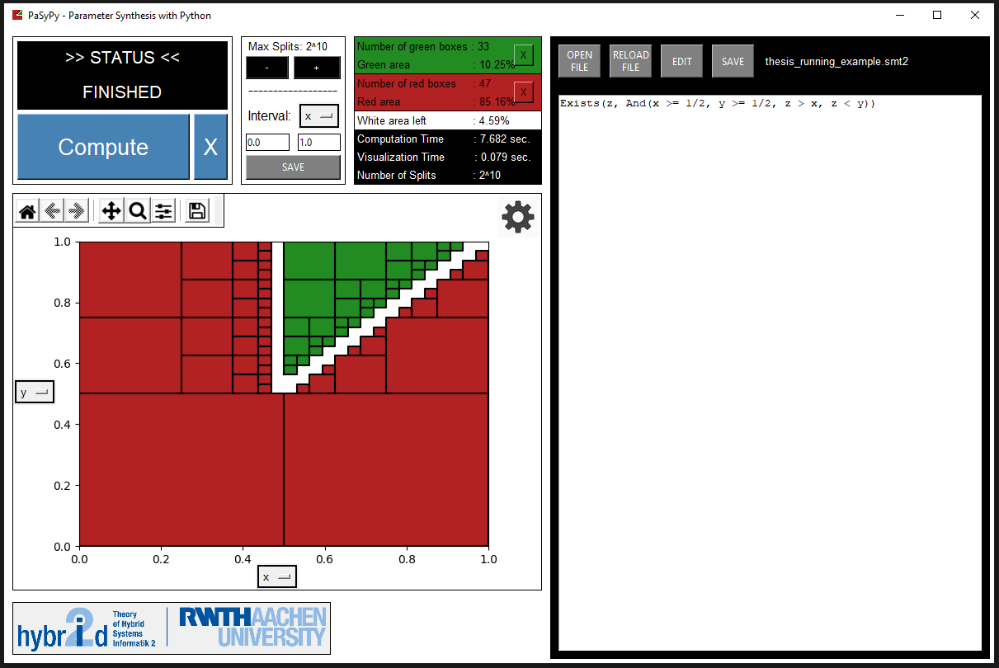

# PaSyPy 
A python-based tool using parameter synthesis to find safe and unsafe regions of the parameter space on nonlinear real arithmetic.

For a detailed description of this project, read the [publication](https://ths.rwth-aachen.de/wp-content/uploads/sites/4/wiegel_bachelor.pdf).

 

## Table of contents
- [1. Installation](#1-Installation)
- [2. Functionality / Usage](#2-Functionality--Usage)
- [3. Suggestions / Bug reports](#3-Suggestions--Bug-reports)

       

## 1. Installation
To install this tool, clone the directory and install all dependencies:
* `z3-solver`
* `matplotlib`
* `scikit-learn`
* `numpy`

All dependencies are also included in `requirements.txt` and can be installed by \
`pip install -r requirements.txt`.

      

## 2. Functionality / Usage
To start this tool, simply execute `__main__.py`.

**Functionality:**
* **SMT-LIB Support:** Read *.smt2* files or define your own formula in the text field.
* **Find safe and unsafe regions:** Separate the whole region of the parameter space into *safe (green)* and *unsafe (red)* regions. Select from different *splitting heuristics* to obtain optimal results.
* **Visualization:** Get a visualization for found safe (green) and unsafe (red) regions. Choose which parameters you want to see. 
* **Information:** Lots of different information about your computation.
* **Settings:** Several settings available.

       

## 3. Suggestions / Bug reports
If you encounter any problems while using this tool or have any suggestions or feedback, \
feel free to contact me. \
Read the [Known challenges](Documentation/README.md/#3-Known-challenges) section in the [documentation](Documentation/README.md) first for a listing of all problems and suggestions.
